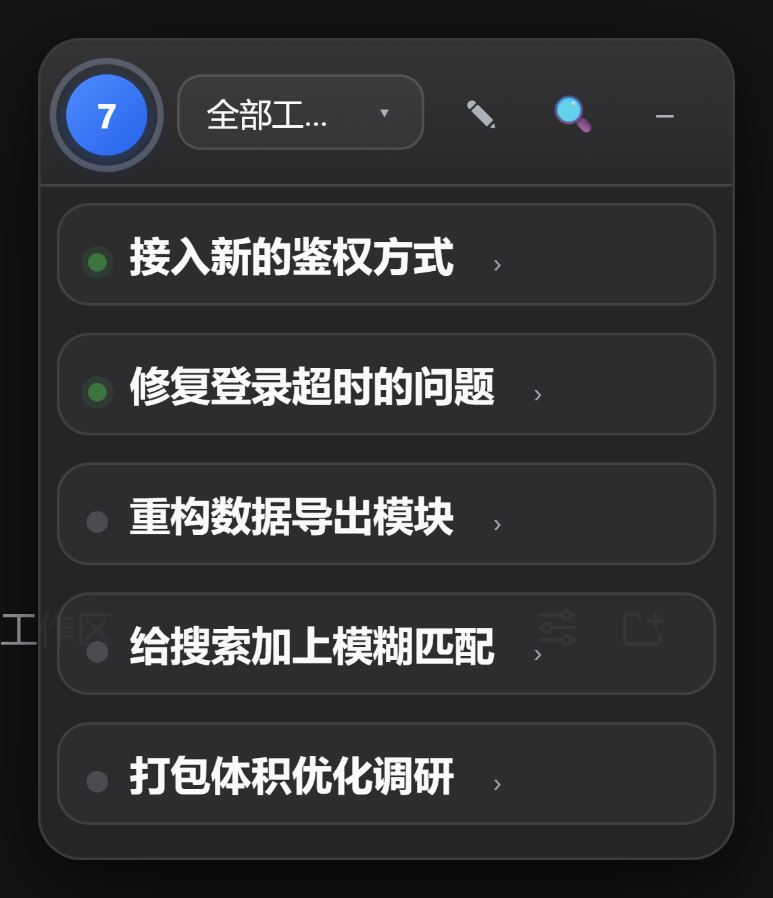

# dsh-topic-trail

> 会话工作线索悬浮窗 —— 把和 AI 的每一次长对话，实时提炼成看得见的「线索」。

`dsh-topic-trail` 是 [dsh](https://github.com/deepseek-ai)（DeepSeek Harness）的插件。它在 Web UI 里挂一个可拖动的悬浮窗，一边对话一边把内容整理成**话题（线索）→ 进度步骤 → 阶段历程**，让你随时知道"这件事做到哪了"。

长会话最常见的困扰是"刚才那段结论在哪儿"。这个插件让线索自己浮出来，点一下就能跳回对话里的那一条。



## 特性

**线索组织**

- **三级网络**：全部工作区 → 工作区 → 会话 → 线索 → 步骤，逐层下钻
- **AI 实时提炼**：用 DeepSeek 把会话流总结成线索（标题 / 摘要 / 状态 / 阶段历程）
- **规则模式兜底**：不调用模型也能用；模型不可用时自动回退，零成本运行
- **阶段历程**：每条线索自动标注演进阶段（提案 / 探索 / 受阻 / 突破 / 完成）；没有 AI 历程时用步骤推断一个基础历程
- **手动整理**：拖拽合并线索、重命名、锁定（锁定后自动总结不会改动它）、删除

**交互**

- **点击跳转**：点线索 / 步骤 / 历程中的任意一条，打开对应对话并滚动定位、高亮那条消息
- **导航下拉 + 搜索**：按工作区 / 会话筛选，或直接搜线索标题
- **悬浮窗**：可拖动、可折叠；收起后是一个会眨眼的小球，大小可调
- **主动展示**：收起状态下偶尔冒出一句融合了最近线索的"碎碎念"气泡；间隔可在设置里调（默认 30 秒），话术会主动避开最近说过的内容
- **状态点三档**：线索前的小圆点按最后活动时间着色——10 分钟内亮绿、一天内暗绿、更久变灰，避免停手不做的线索一直亮着绿灯
- **随手记**：内置便签与画笔工具；画笔存的是笔画路径（非位图），支持撤销、缩放不糊，内容存在服务端而非仅浏览器
- **多皮肤**：内置经典皮肤与 DeepSeek 主题，两套皮肤的头像、话术、气泡样式各自独立
- **跟随 dsh**：在 dsh 里删除的工作区、归档的对话会自动从列表隐藏（可在设置里展示已删除项）

**工程**

- **零构建**：client 半是纯 React + `h()`，直接由 dsh 提供，改完刷新即生效
- **快照缓存 + 分块折叠**：会话很多时列表接口从数十秒降到毫秒级
- **子代理过滤**：按血缘（`origin` / `delegationDepth`）识别并排除子代理会话，不与主会话混在一起
- **省 token**：总结前先比对内容指纹跳过无变化的调用，并设最小间隔（默认 20 秒）；可在设置里看估算用量（气泡与总结分开统计），并提供一键「轻简模式」

## 安装

```powershell
# 指向你自己的 dsh 安装目录（下面用 $DSH_HOME 表示）
$env:PATH = "$DSH_HOME\tools\node_modules\.bin;" + $env:PATH
dsh plugin --profile web add file:C:/path/to/dsh-topic-trail
```

然后重启 dsh。

也可以把本目录放进 `$DSH_HOME/plugins/`，再用 `cordis.patch.yml` 的 `insert` 段注册。

## 配置

设置页里的选项会持久化到 `$DSH_HOME/data/topic-trail/config.json`，覆盖 `cordis.patch.yml` 里的基线值。

| 键 | 说明 | 默认 |
| --- | --- | --- |
| `summarize` | 总结方式：`auto`（优先 AI，失败回退规则）/ `llm`（强制 AI）/ `rule`（仅规则，不调模型） | `auto` |
| `provider` / `model` | 总结用的 provider 与模型，留空则自动探测 dsh 的当前配置 | 自动 |
| `pollMs` | 前端轮询间隔（毫秒） | `3000` |
| `bufferSize` | 送给模型的上下文窗口大小 | `40` |
| `followSession` | 切换对话时自动跟随到该对话 | `true` |
| `learnFromModifications` | 记住你手动合并 / 整理的习惯，后续总结时参考 | `true` |
| `preserveTopics` | 总结时保留已有线索，只追加新线索 | `true` |
| `workspaceMemory` | 记住每个工作区的项目结构与总结偏好 | `true` |
| `workspaceViewMode` | 工作区视图：`merge`（相似线索聚类）/ `bySession`（按对话分块） | `bySession` |
| `skin` | 皮肤：`default`（经典蓝球）/ `deepseek`（DeepSeek 娘） | `default` |
| `ballScale` | 收起小球的大小倍率（`0.6` ~ `1.6`） | `1` |
| `bubbleIntervalSec` | 主动展示气泡的间隔秒数（`5` ~ `300`，实际有 0.7~1.5 倍随机抖动） | `30` |
| `showRemovedItems` | 展示在 dsh 里已删除的工作区 / 已归档的对话（默认隐藏） | `false` |
| `leanMode` | 轻简模式（省 token）：总结间隔拉到 90 秒、不喂推理内容、气泡间隔翻倍 | `false` |
| `topicOrder` | 线索排序：`llm`（AI 组织顺序）/ `created`（按创建时间倒序，最新在上） | `llm` |
| `eyeAnimation` | 收起小球跟随鼠标的数字瞳孔、眨眼动画 | `false` |
| `proactiveDisplay` | 主动展示气泡 | `true` |
| `enabled` | 插件总开关（关闭后隐藏悬浮窗、停止记录） | `true` |

## 使用

- **点线索标题**：展开阶段历程；步骤收在「显示步骤（N 步）」按钮后面，避免上千步的流水账把脉络淹没
- **点历程 / 步骤**：跳转到对话里的对应位置
- **右键线索**：重命名 / 删除 / 合并
- **拖拽线索到另一条上**：合并（可走 AI，也可走规则）
- **右键工作区**：重新生成该工作区的全部线索
- **Esc**：逐层关闭浮层（右键菜单 → 画笔菜单 → 导航下拉 → 搜索 → 便签 → 展开的线索）

## 工作原理

1. host 半订阅 dsh 的会话事件流，把事件归一化成"步骤"，按规则即时聚成线索
2. 累积到一定量后把上下文交给 DeepSeek 总结，产出线索、阶段历程与摘要
3. client 半轮询快照渲染悬浮窗；步骤正文按需拉取（展开时才请求）

几个值得一提的实现细节：

- **事件序号是全局的**：`step.seq` 跨会话递增（可到百万级），所以跳转定位必须用**会话内的相对位置** `(seq - min) / (max - min)`，不能拿步骤条数当分母
- **时间戳来自事件本身**：每个 dsh 事件都带 `time`，host 直接采用它；若用"插件处理这一刻"代替，历史重放会让成千上万条步骤的时间挤在同一秒，定位就失效了
- **重新生成有保护**：读不到事件日志时不清空；结果为空或缩水到不足原来的 1/3 时整体回滚；已锁定与手动合并过的线索重建后会放回

## 已知限制

- **旧线索的定位精度**：早期版本生成的线索里，步骤时间记的是"导入时刻"而非真实时间，只能按事件序号比例估算位置（±几条消息）。重新生成该会话的线索即可修正
- 主动展示气泡依赖浏览器的定时器；标签页长时间后台时可能被节流，间隔会变长

## 开发

- `lib/index.js` — host 半：路由、事件处理、规则聚类、LLM 总结、持久化
- `lib/client.js` — client 半：悬浮窗 UI（零构建，纯 `h()`）
- `cordis.patch.yml` — dsh 插件注册与基线配置

改完 host 需要重启 dsh；只改 client 的话刷新浏览器即可。

## 许可

MIT

---

*本项目由人机协作开发：需求、验收与产品判断由人类给出，实现与排查由 AI 完成。*
